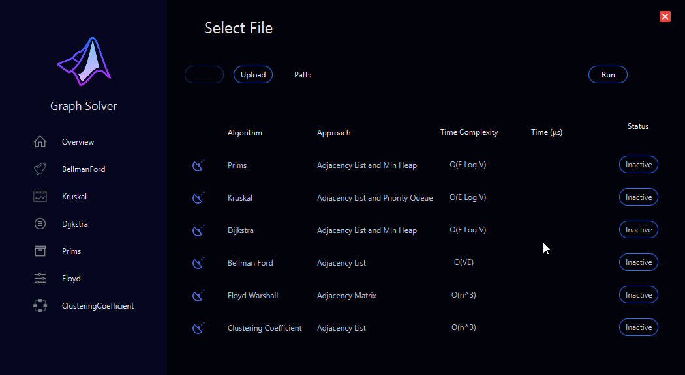
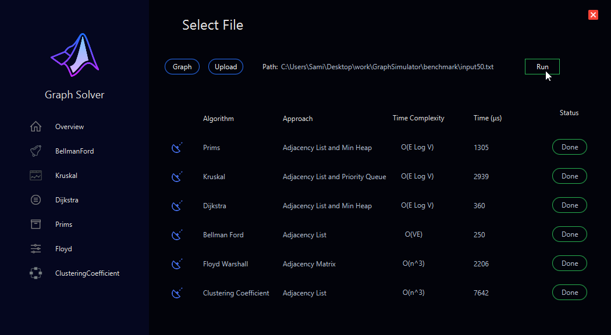
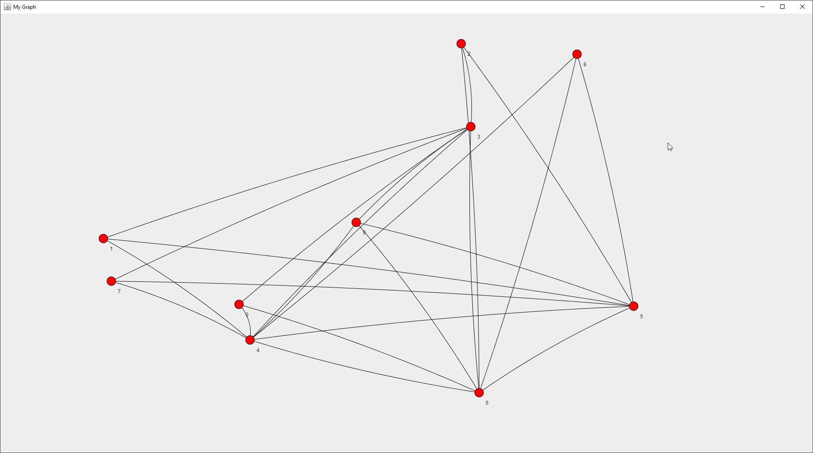
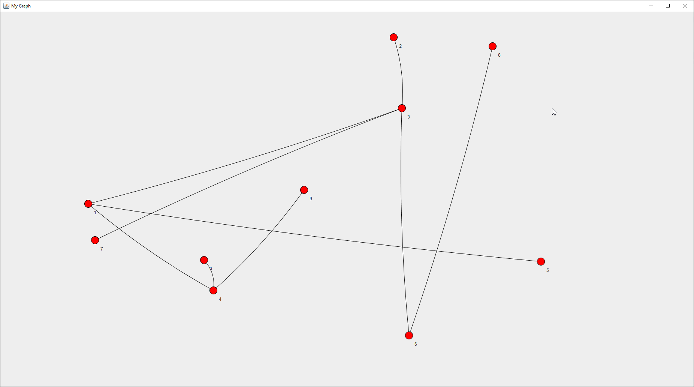
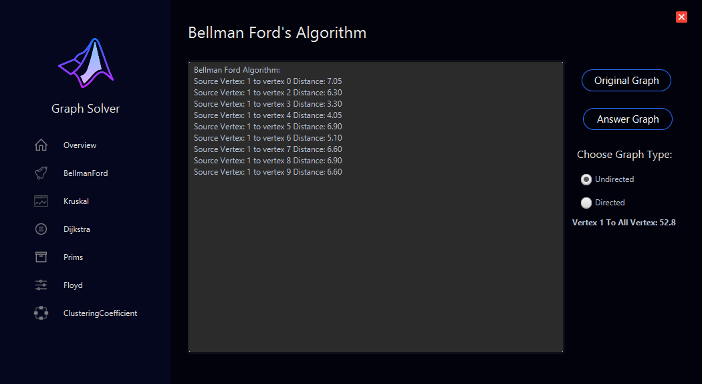
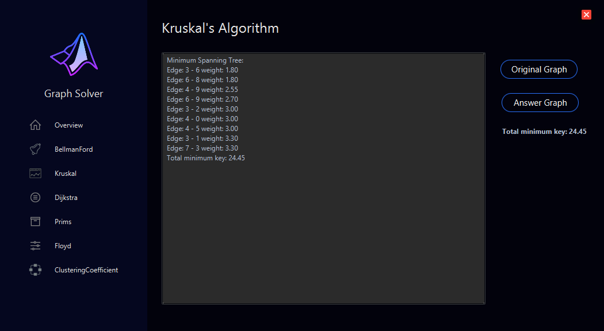
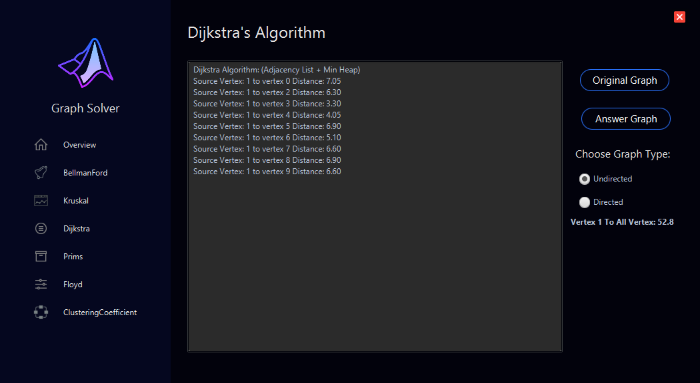
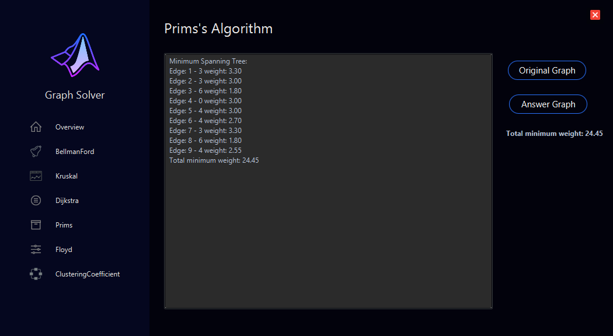
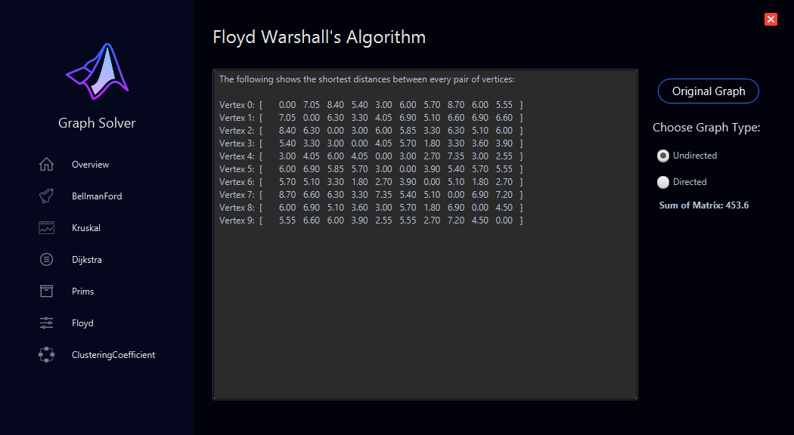
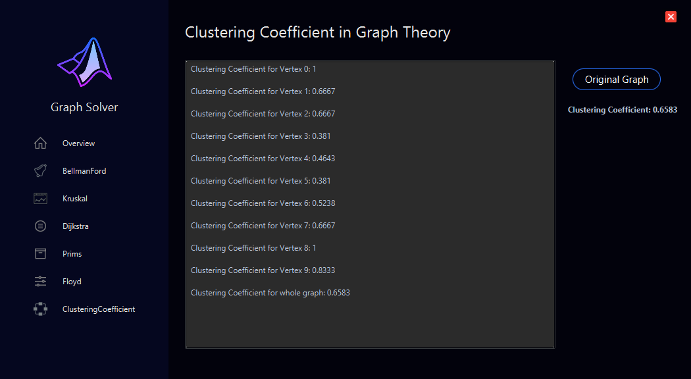

# Graph Simulator In JavaFX & Jung

This Graph Simulator is made On **JavaFX** & **Jung**

## Features

1. File Selector
2. Algoritm Selector with Execution Time mesearment
4. Graph Vizualization with **Jung**
4. Bellman Ford
5. Kruskal
6. Dijkstra
7. Prims
8. Floyd
9. Clustering Cofficient

## Images

  
  
  
  
  
  
  
  
  
  
  